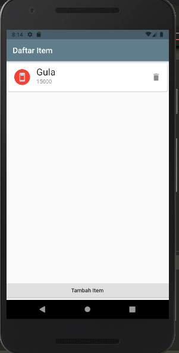
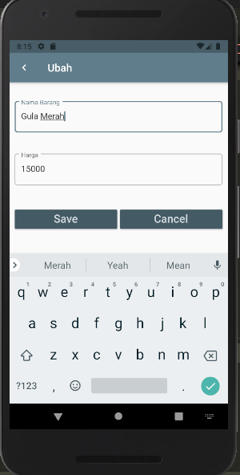
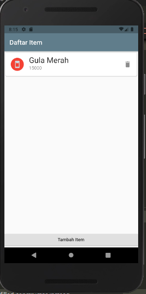
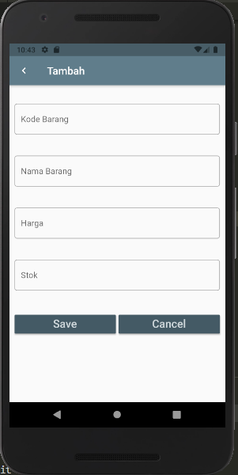
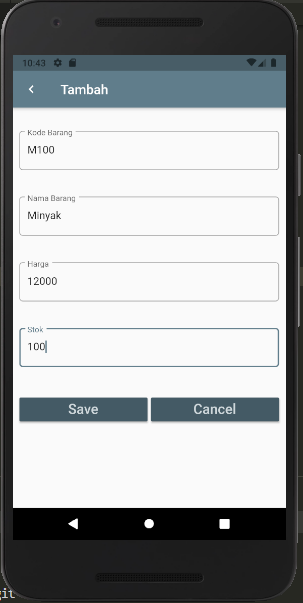
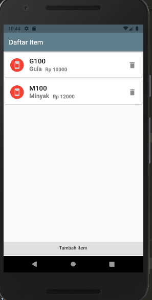

# Praktikum 6 (Week 7)

# Hasil Bentuk Video

 

<li><b>Nama  : Riris Silvia Zahri
<li><b>Kelas : MI 2A
<li><b>NIM   : 1931710085

# Hasil Dari Praktikum6 
Tampilan Halaman Home 

 

## 
 
Tampilan Halaman jika ditambah item maka harus memasukan Textform dan klik button save 

 

## 
Tampilan Halaman Home setelah ditambah item 

 

# Hasil Dari Tugas 
## Hasil Dari Tugas1

Tampilan Halaman Home sebelum item di edit 

 

Tampilan Halaman merubah item nama dan klik button save 

 

Tampilan Halaman ketika item sudah di edit 

 

## Hasil Dari Tugas2

Tampilan Halaman Ubah setelah di tambahkan variabel Kode Barang dan stok 

 

add item dan isi semua textform kemudian diklik button save 

 

Tampilan Halaman ketika item sudah di tambahkan dengan variabel baru  

 

